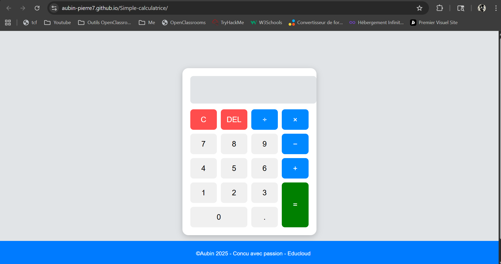
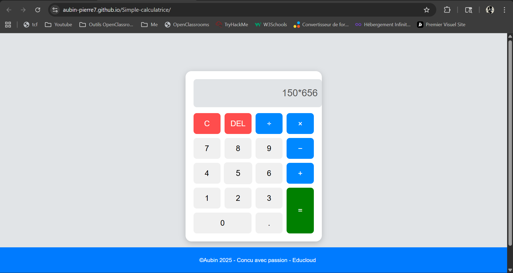

# Simple-calculatrice.

Elle permet d'effectuer les operations arithmetiques de base:  
 Addition, Soustraction, Multiplication, Division. 

# Demo en ligne:
Lien du site en ligne: https://aubin-pierre7.github.io/Simple-calculatrice/ .

# Technologies utilisees:
-*HTML*;
-*CSS*;
-*JavaScript*.

# Captures d'ecran:

|  |  |  | .
